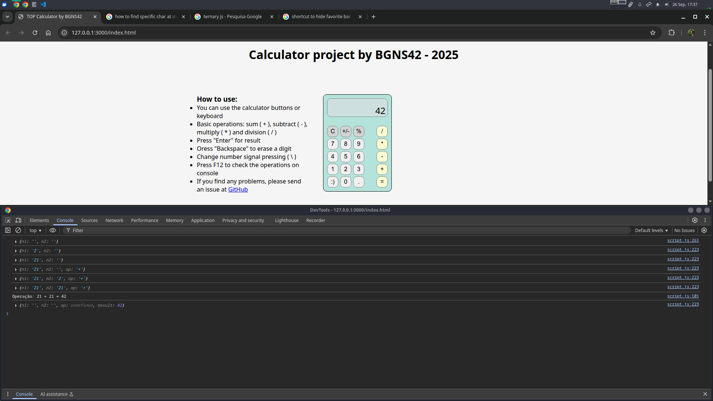

# 🧮 Calculator Project - The Odin Project Fundamentals

## 🚀 Project Overview
This Calculator is the final project for the Fundamental Course of The Odin Project's (TOP) curriculum. It was built from scratch, demonstrating core web development skills in HTML, CSS, and JavaScript. The goal was to create a fully functional, interactive calculator application that handles basic arithmetic operations and user input.

## ✨ Features
- **Basic Arithmetic Operations:** Handles addition, subtraction, multiplication, and division.
- **Comprehensive Input Support:** Fully functional via both on-screen buttons and keyboard input, including numbers, operators, Enter (for =), Backspace (for '⬅'), and \ (for '+/-').
- **Intelligent Decimal Handling:** Manages decimal numbers accurately and rounds results to a maximum of 4 decimal places for precision control.
- **Dynamic Display Formatting:** Automatically shifts to scientific notation for excessively large or small numbers to maintain readability.
- **Sign Toggle Functionality:** Easily switch the sign of the currently active number (positive/negative) for n1 and n2.
- **Clear & Erase Controls:** Dedicated functions to clear all input (C) or erase the last entered digit (⬅).
- **Responsive Layout:** Utilizes CSS Flexbox to ensure a well-structured and adaptable user interface across different screen sizes.

## 🛠️ Technologies Used
- **HTML5:** Structured the calculator's components and overall page layout semantically.
- **CSS3 (Flexbox):** Styled the application, creating an intuitive and visually appealing interface, and implemented advanced Flexbox techniques for layout control and responsiveness.
- **JavaScript (ES6+):** Engineered all core calculator logic, including arithmetic operations, state management, event handling for mouse and keyboard inputs, and dynamic display updates.

## 💡 What I Learned & reinforced
This project was a significant milestone in my journey through The Odin Project's Fundamentals. Key learning outcomes include:

- **DOM Manipulation:** Extensively manipulating the Document Object Model to dynamically update the calculator's display and respond to user interactions.
- **Event Handling:** Implementing various event listeners for both mouse clicks and keyboard inputs, and managing event flow.
- **JavaScript Logic & Control Flow:** Developing robust arithmetic functions, handling edge cases (e.g., division by zero), and managing application state within a display object.
- **CSS Layouts (Flexbox):** Mastering Flexbox for creating a responsive and well-organized layout for the calculator and surrounding content.
- **Code Organization & Readability:** Structuring JavaScript functions logically and writing clean, maintainable code.

## ⚙️ How to Run
Try it [live](https://bgns42.github.io/top-calculator/)! or:
1. Clone the repository:
```
bash
git clone https://github.com/BGNS42/top-calculator.git
```

2. Navigate to the project directory:
```
bash
cd top-calculator
```

3. Open `index.html`: Launch `index.html` in your preferred web browser to access the calculator.

## 📸 Screenshots



## 🚧 Challenges & Solutions
- **Ensuring Calculation Accuracy & Display:**
    - **Challenge:** Handling floating-point inaccuracies in JavaScript and displaying very large/small numbers cleanly.
    - **Solution:** Implemented toFixed() for precise decimal rounding and toExponential() for automatic scientific notation display on large/small results.
- **Seamless Keyboard Integration:**
    - **Challenge:** Mapping diverse keyboard keys (numbers, operators, special keys like Enter/Backspace/`) to corresponding button actions and preventing default browser behaviors.
    - **Solution:** Developed a comprehensive keydown event listener that intelligently maps keys to button textContent and calls existing click handlers, coupled with e.preventDefault().
- **Robust Sign Toggle Logic:**
    - **Challenge:** Creating a single function to reliably change the sign of either n1 or n2 based on the current calculator state.
    - **Solution:** Designed a checkSignal function using conditional logic to determine the active operand and efficiently toggle its sign using startsWith() and slice().

## 🧑‍💻 Author
Made by [BGNS42](https://github.com/bgns42)
Feel free to connect with me on [LinkedIn](https://www.linkedin.com/in/igor-carrasco) or explore my other projects on GitHub!

## 📄 License
This project is open-source and available under the [MIT License](https://github.com/BGNS42/Project-Etch-a-Sketch/blob/main/LICENSE).